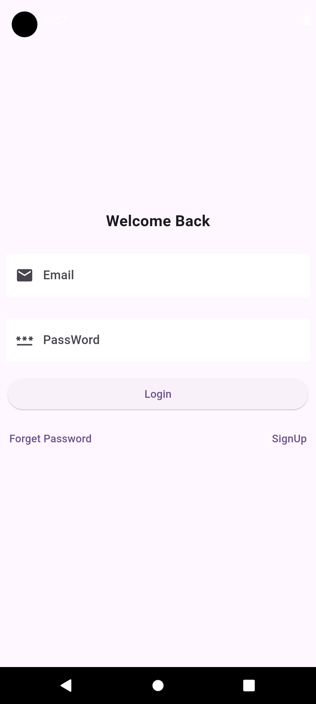
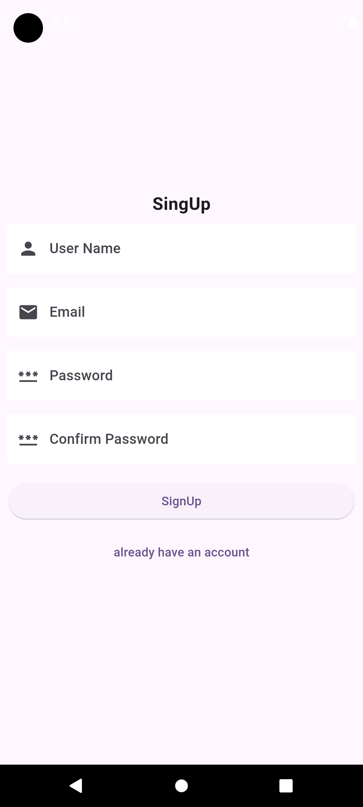
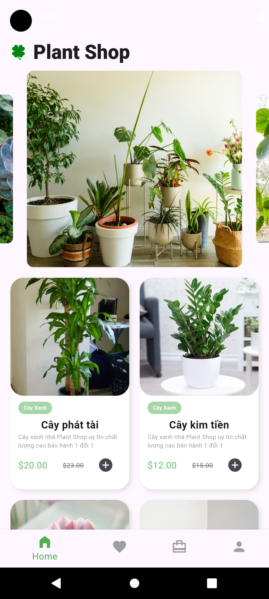
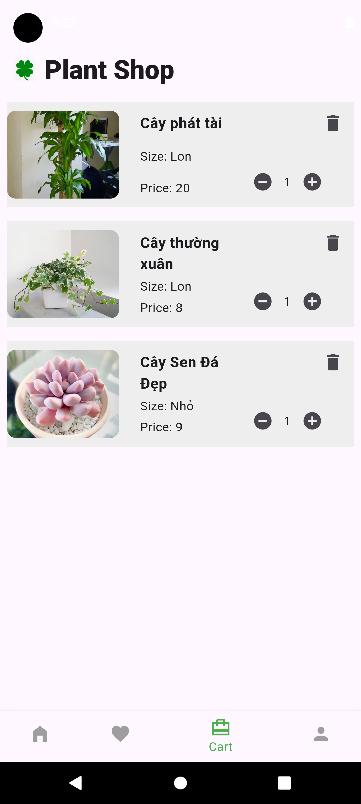
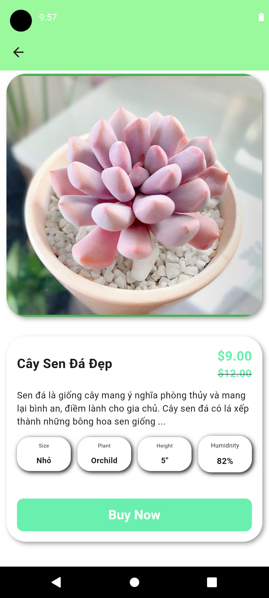
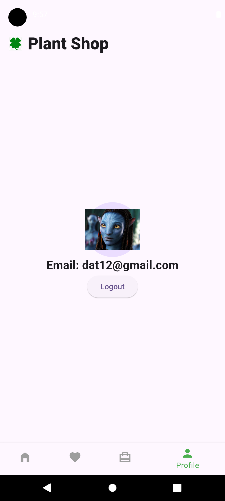

# plant_app

A new Flutter project.

## Getting Started

This project is a starting point for a Flutter application.

A few resources to get you started if this is your first Flutter project:

- [Lab: Write your first Flutter app](https://docs.flutter.dev/get-started/codelab)
- [Cookbook: Useful Flutter samples](https://docs.flutter.dev/cookbook)

For help getting started with Flutter development, view the
[online documentation](https://docs.flutter.dev/), which offers tutorials,
samples, guidance on mobile development, and a full API reference.

## Mô tả dự án 
Dự án sử dụng flutter để vẽ app plant_app
<table>
  <tr>
    <td></td>
    <td></td>
    <td></td>
    <td></td>
  </tr>
  <tr>
    <td>Ảnh Login</td>
    <td>Ảnh SingUp</td>
    <td>Ảnh Trang chủ</td>
    <td>Ảnh Cart</td>
  </tr>
</table>
<table>
  <tr>
    <td></td>
    <td></td>

  </tr>
  <tr>
    <td>Ảnh Detial</td>
    <td>Ảnh Profile</td>

  </tr>
</table>

